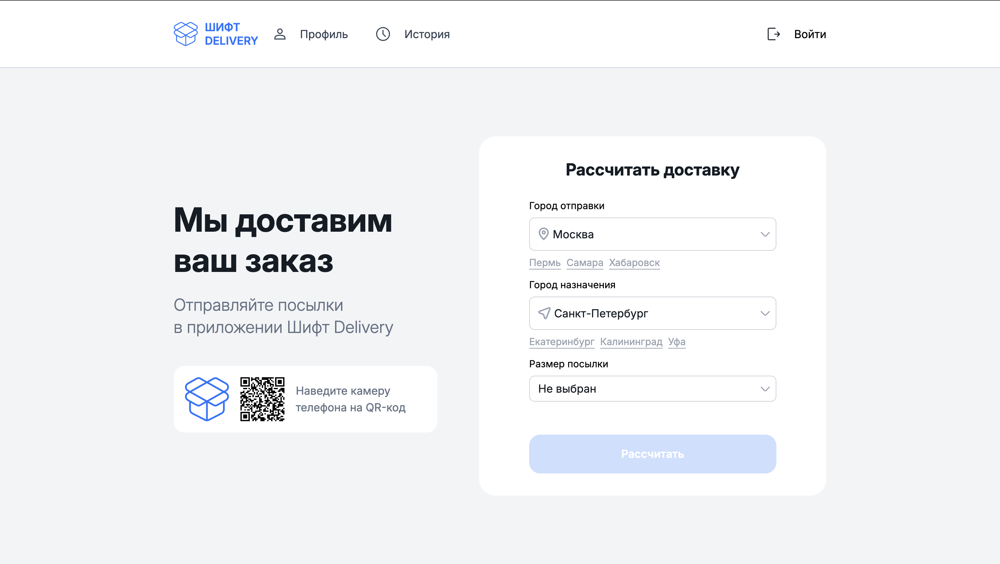
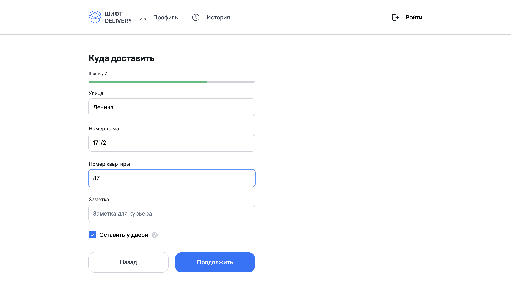
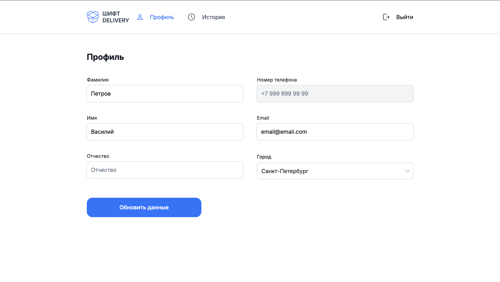
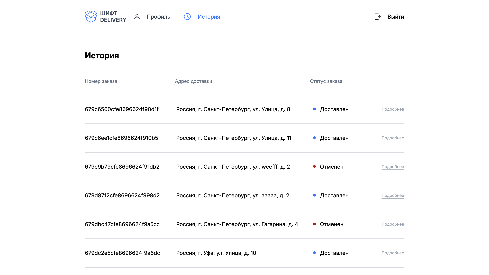

# **Проект "Доставка товаров"**

Стек: React, TypeScript, Redux Toolkit, SCSS Modules, Vite

## Что было сделано

В рамках проекта были решены следующие задачи:

- реализована авторизация по отп-коду и сохранение токена в куки
- настроены защищенные роуты
- реализован кастомный ui-kit
- реализованы формы с валидацией для флоу оформления заказа
- добавлена возможность редактировать данные профиля
- добавлена возможность просматривать историю заказов и отменять доступные заказы

Ниже примеры некоторых страниц:

### Главная страница



### Пример формы из флоу оформления заказа



### Профиль



### История заказов



## Установка и запуск

1. Создайте в корне проекта файл `.env` с содержимым файла `.env.example`
2. Установите зависимости и запустите проект:

```
npm install
npm run dev
```
